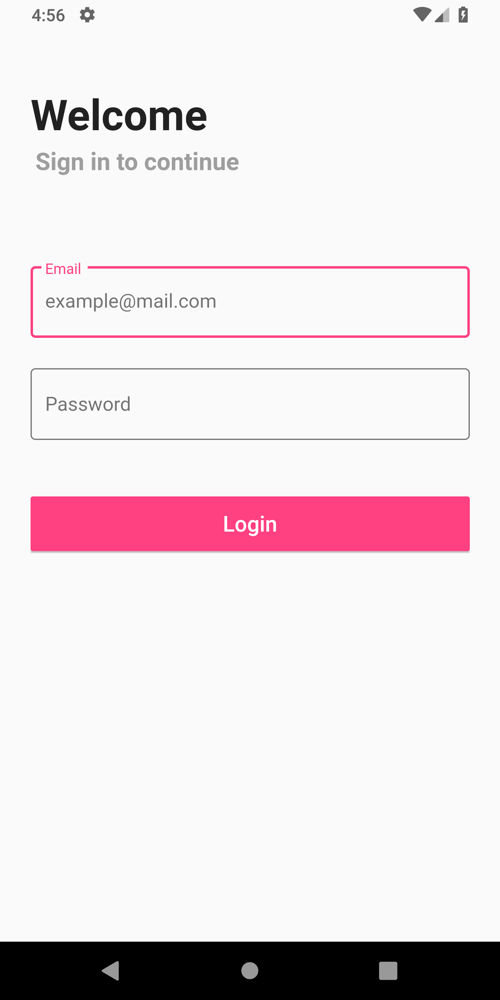
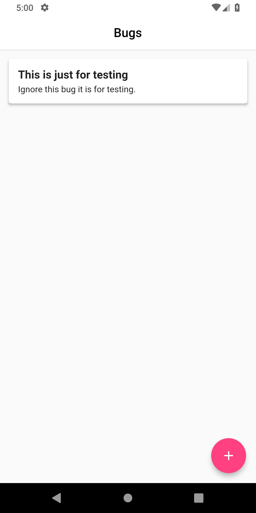
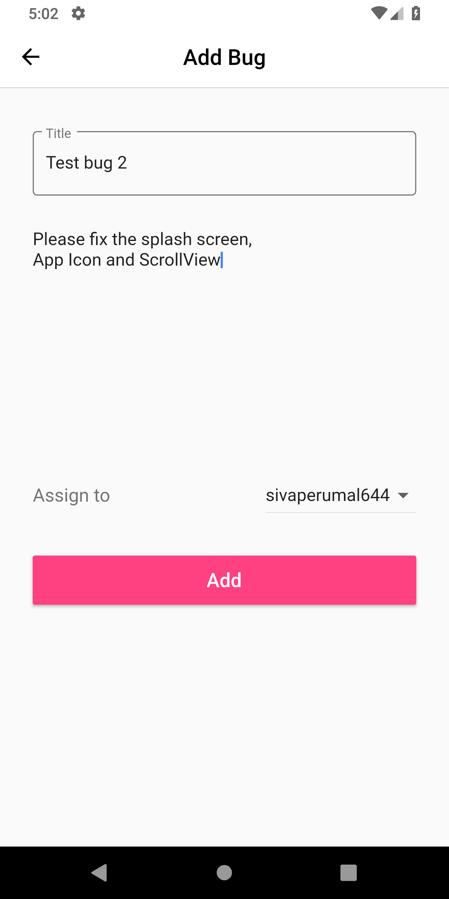
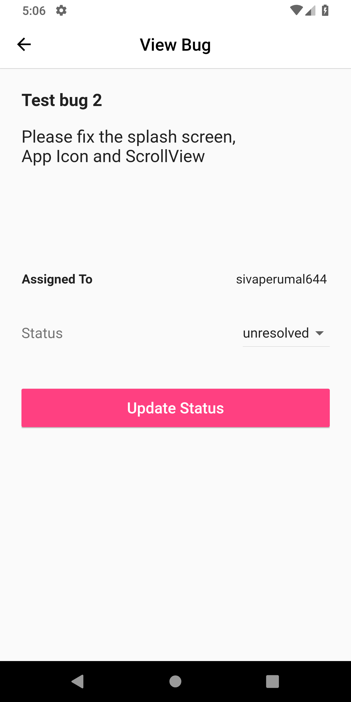

# Bug Tracker Flutter 

It's a BugTracking app that small development teams can use to track their progress and what happens in the team.

It's is build using Flutter SDK and Dart. And uses graphql_flutter to connect with the graphql server.

### Server

[Bug Tracker Server](https://github.com/vineeshvk/BugTrackerServer) is the server used as a backend for this flutter app. 

### Release

#### Android app
[BugTracker.apk](https://github.com/vineeshvk/BugTrackerFlutter/releases/download/1.0/bug-tracker.apk)

(sample_user => email : admin, password : admin)

### Screenshots

### Features
- create user(admin or normal)
- login
- create bug and assign
- view bugs
- change status of bugs
- checks for update every 3 seconds

### Libraries used
- [graphql_flutter](https://pub.dartlang.org/packages/graphql_flutter)

